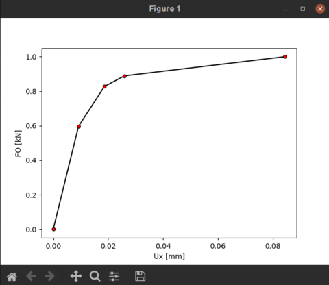
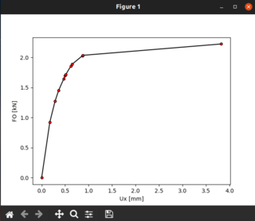

# Elastoplastic Analysis Of Plane Frames

My master's thesis on the subject of "Elastoplastic analysis of plane frames". The emphasis of the thesis was to develop a program for calculating the critical load
of plane frames that will lead to their failure. The paper as well as the comments in the source code are in my mother tongue - Bosnian.

Originally the source code has been written in Matlab, as that was the only "language" I knew at the time of writing the thesis. Later on the program was rewritten 
(and slightly improved) in Python.

__As I was a complete newbie in programming at that time, there were a lot of things I did not know about coding, so don't mind code repeating, bad names and other 
code smell you might find in the source code.__

Some screenshots:

